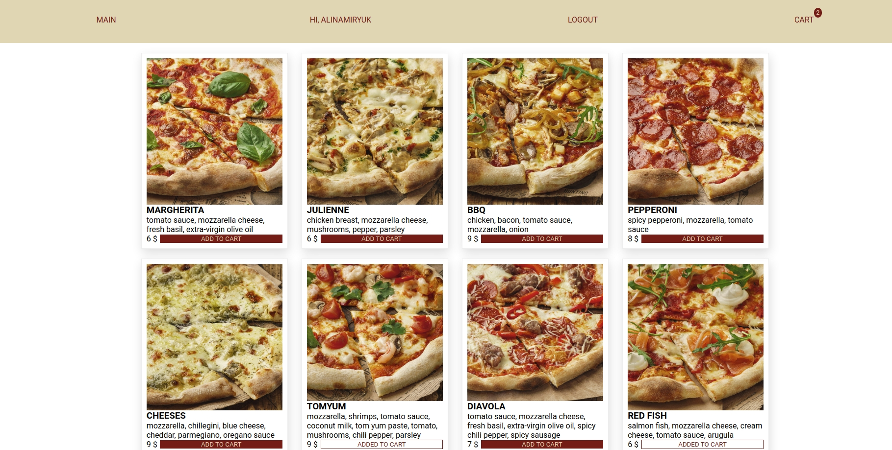
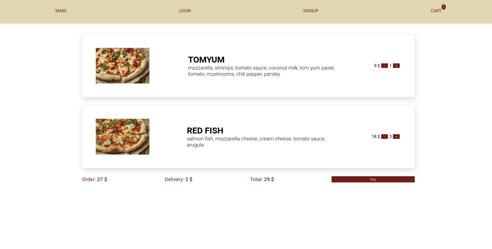
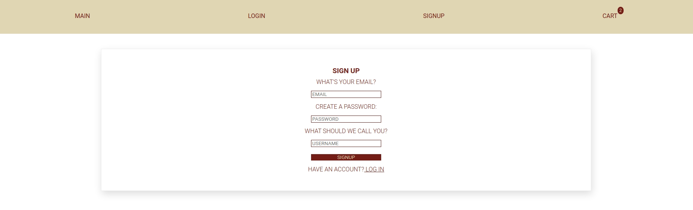
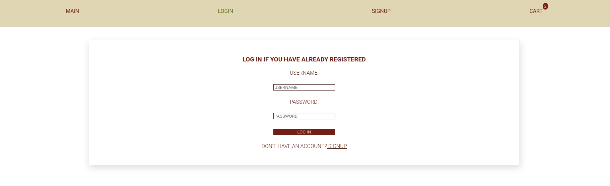

# ThePizzaTask
A small web application for online pizza ordering. The
idea is to make a non-existing service where assumed clients can choose a pizza, put it into a cart and make an order.

## Stack
MERN (MongoDB, Express, React, Node), Redux, Redux-Thunk, CSS

## Requirements:
* The task should be completed in English
* The menu page should contain at least 8 pizzas
* Don’t forget to add delivery costs to the final bill. It can be a static figure
* The app should have login and registration options. Please make sure that the login option is not mandatory for users (in other words, a user should be able to make an order without logging in)
* Don’t proceed to the payment page
* Please, add a form validation for the login (password validation, e-mail validation, etc.)

## How to start

```
cd backend/ 

npm i
npm start

cd ..
cd frontend/

yarn install
yarn start
```

## A page where you can take a look at pizzas available for order 


## Edit a quantity of pizzas for your order or delete them from your cart at all


## Authentication


